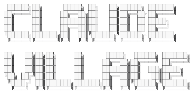
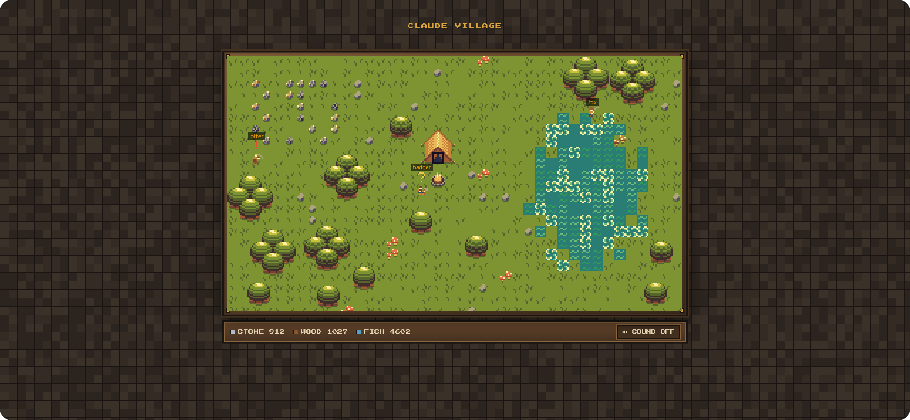

<p align="center">
  
</p>

<p align="center">
  <b>Watch all your Claude Code sessions work as a pixel-art village.</b><br>
  Every session becomes a worker. You see at a glance who is busy, who is waiting for you, and who has gone to rest.<br>
  Local, read-only, driven entirely by Claude Code hooks.
</p>

<p align="center">
  
  
  
</p>

<p align="center">
  
</p>

<p align="center">
  <a href="#quick-start">Quick start</a> ·
  <a href="#what-you-see">What you see</a> ·
  <a href="#how-it-works">How it works</a> ·
  <a href="#privacy">Privacy</a> ·
  <a href="#configuration">Configuration</a> ·
  <a href="#development">Development</a> ·
  <a href="#contributing">Contributing</a>
</p>

If you run ten or twenty Claude Code sessions at once, the terminal tabs stop telling you what is happening. Claude Village puts them on a second monitor as a small world: a worker per session walks to a mine, a forest or a river and works there while Claude works. When a session needs your permission or an answer, its worker raises a sign. When a session goes quiet, its worker heads to the campfire, and when the session ends, it goes home to the town hall.

## Quick start

Requires Node.js 18+ and Claude Code. Linux and macOS are supported.

```bash
npm install -g claude-village

claude-village install   # register hooks in ~/.claude/settings.json
claude-village start     # start the local server
```

Open **http://127.0.0.1:4791** in your browser and start a Claude Code session. Its worker leaves the town hall.

The hooks store the absolute path to the installed package. If you switch Node.js versions (for example with nvm) or reinstall the package, run `claude-village install` again so the hooks point to the new location.

## What you see

| Session state | Worker |
| --- | --- |
| Just started | Walks out of the town hall to a free spot |
| Working | Mines, chops or fishes, and the resource counter grows after each tool call |
| Waiting for your reply | Stands still with a **?** above its head |
| Waiting for your permission | Shows a **!** above its head, on top of any other state |
| Silent for 2 minutes | Walks to the campfire and sits there with a **z** |
| Silent for 3 hours or session ended | Goes back to the town hall and disappears |

Each session keeps the spot type it was given (ore, wood or fish) for its whole life. Any new event from a session wakes its worker and sends it back to its spot. Hover over a worker to see its project name, state and time since the last event.

The HUD shows three counters: **stone**, **wood** and **fish**. They are kept in memory and reset when the server restarts.

## How it works

Claude Code hooks are the only data source. The installer registers a small hook script for ten events: `SessionStart`, `UserPromptSubmit`, `PreToolUse`, `PermissionRequest`, `PostToolUse`, `Notification`, `Stop`, `SubagentStart`, `SubagentStop` and `SessionEnd`.

1. The hook reads the event from stdin, appends one short JSON line to `~/.claude-village/events.ndjson` and exits with code 0. It never writes to stdout or stderr, never blocks Claude Code and swallows its own errors.
2. The local server reads that file from its last offset, tolerating truncation and rotation, and keeps the authoritative state of every session in memory.
3. The browser opens one Server-Sent Events stream. It receives a full snapshot first, then deltas, and reconnects on its own. The page only animates what the server says.

The server listens on `127.0.0.1` only and accepts requests only with a `Host` header of `127.0.0.1` or `localhost` on its port, which protects it from DNS rebinding.

## Privacy

Claude Village is built to see as little as possible.

- **Recorded locally** in `~/.claude-village/events.ndjson`: timestamp, event name, session ID, working directory, tool name and agent ID.
- **Never recorded:** prompts, responses, tool inputs, tool outputs and file contents.
- **Sent to the browser:** event type, session ID, agent ID, project name (the folder's base name only), and the derived worker state. Full paths are never sent.

Everything runs on your machine. Nothing is sent to any external service.

## Configuration

These are the defaults the server runs with:

```json
{
  "port": 4791,
  "spots": { "mine": 2, "forest": 2, "river": 2 },
  "idle": { "restAfterSec": 300, "leaveAfterSec": 600 },
  "subagents": { "maxVisible": 6, "idleSec": 30 },
  "events": { "maxFileBytes": 5242880 }
}
```

- `port`: can be overridden for a single run with `claude-village start --port <number>`.
- `spots`: how many workers can work on each type of spot at the same time. The rest queue near the least busy spot type.
- `idle`: when a silent session walks to the campfire, and when its worker leaves the village.
- `events.maxFileBytes`: the events file is truncated once the server has consumed it and it has grown past this size.

Editing the values in a config file is not supported yet; they are defined in [`src/shared/config.ts`](src/shared/config.ts).

## Uninstall

```bash
claude-village uninstall
```

This removes only the hooks Claude Village added. Your other Claude Code settings are not touched. The backup created by `install` remains in `~/.claude/`, and `~/.claude-village/` is yours to delete.

## Development

Run the client with hot reload, and use the sandbox to generate fake sessions instead of starting real ones:

```bash
claude-village start                 # terminal 1: server on :4791
npm run dev:client                   # terminal 2: Vite dev server, proxies /events to the server
npm run dev:sandbox -- --sessions 20 # terminal 3: synthetic events for 20 sessions
```

Other scripts:

- `npm test`: unit and integration tests on `node:test`.
- `npm run typecheck` and `npm run typecheck:client`: type checks for the Node and browser parts.
- `npm run build`: compiles the server and hook to `dist/` and bundles the client into `dist/client/`.

## Contributing

Bug reports and ideas are welcome in the [issue tracker](https://github.com/yognevoy/claude-village/issues). For code changes, fork the repository, create a branch, and open a pull request with a short description of what changed and how you tested it. Run `npm test` and `npm run typecheck` before submitting.

## License

This project is licensed under the MIT License - see the [LICENSE.txt](LICENSE.txt) file for details.

## Credits

Pixel-art tiles from [Mini Medieval](https://v3x3d.itch.io/) by VEXED.
